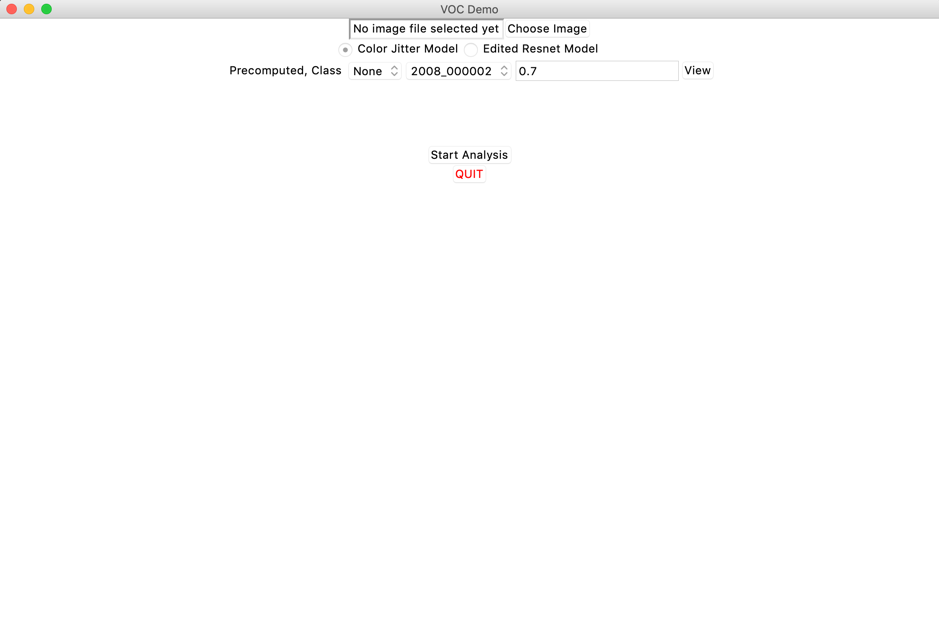
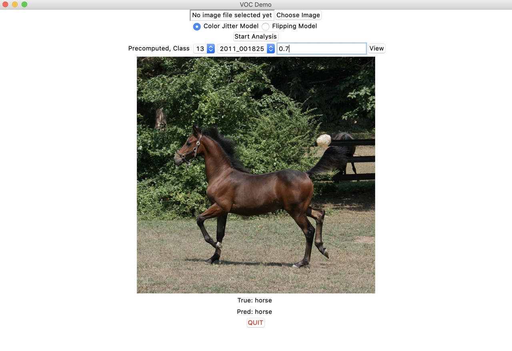

# VOC Object Classification using PyTorch

## Getting Started
```
$ git clone https://github.com/junqingchang/torch-voc-with-gui
$ cd torch-voc-with-gui/dataset
```

Try to run
```
$ ./get_dataset.sh
```

If you get permission denied, run
```
$ chmod +x get_dataset_sh
$ ./get_dataset.sh
```

Next,

```
$ cd ..
$ pip install -r requirements.txt
```

## Model Training
There are 2 different models here, both are train via transfer learning from resnet18. Difficult images are ignored

Model 1 consist of Color Jitters to augment the image.
Training is done by `ColorMeOver5Times.py`

Model 2 consist of an additional Average Pooling layer at the end of resnet18 and jitter augmentations. Training is done by `ColorFlipEditedRes.py`

Both files consist of hyperparameters that can be edited. 

Do take note to create your output directory before starting to train

Upon training, the other python files will be useful for displaying information

`dataviewer.py` and `accuracy.py` will display loss over time and tail accuracies

`get_outputs.py` generates true and predicted values from a validation/test set

`precomputed.py` generates precomputed values for the GUI (i.e. Image rankings)

## GUI



Run 
```
$ python vocapp.py
```

The GUI provides the capabilities of predicting a new image, as well as seeing a list of precomputed images. If a class is chosen, the list will be arranged in decending order of scores for that class. Users are able to edit the threshold hyperparameter to see at different threshold what the predictions are.